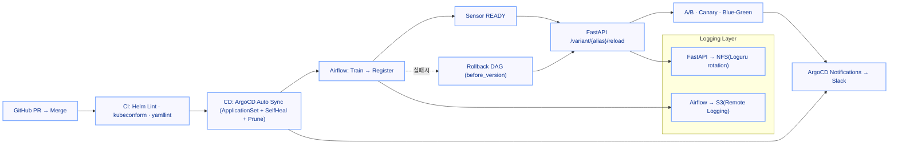

# 🧱 MLOps Infrastructure – One Commit Flow

> “Git 커밋 한 번으로 학습 → 등록 → 배포 → 실험 → 관제까지 자동 순환하는 MLOps 플랫폼.”
> 

---

## 📘 Overview

이 프로젝트는 **Helm 기반 MLOps 인프라**를

**GitOps(ArgoCD)** 중심으로 재설계하여

모델 실험부터 배포, 관제, 보안까지 **완전 자동화된 루프**를 구축한 사례입니다.

- **Helm 템플릿 재사용 + GitOps 자동화 계층 추가**
- **Airflow · MLflow · FastAPI 3축 연동**
- **SealedSecret · cert-manager · ApplicationSet 기반 운영**
- **내부망에서도 완전 자동화 가능한 MLOps 루프**

---

## 🧩 Architecture

### Core Components

| Layer | Stack | Description |
| --- | --- | --- |
| **Orchestration** | Airflow (KubernetesExecutor) | 모델 학습, 등록, 롤백, Slack 알림 |
| **Experiment Tracking** | MLflow Tracking + Registry | 실험·모델 버전 관리 (S3 + PostgreSQL) |
| **Serving** | FastAPI (A/B · Canary · Blue-Green) | MLflow 모델 자동 로드 + 실험형 서빙 |
| **CI/CD** | GitHub Actions + ArgoCD | Helm Lint → Auto Sync → Slack 통합 알림 |
| **Security** | SealedSecret + Rotation/Re-Seal | AWS 키 자동 회전 및 컨트롤러 키 재암호화 |
| **TLS** | cert-manager (내부 CA) | 외부 노출 없이 자동 갱신되는 TLS 체계 |
| **Storage** | NFS (내부) + S3 (외부) | 로그 이원화 및 장기 보관 구조 |
| **Monitoring** | Slack Notifications | Airflow / ArgoCD / Deployment 상태 보고 |

---

## ⚙️ System Flow

### One Commit Flow



> PR → CI → CD → Slack → 실험까지,
> 
> 
> 수동 개입 없는 자동화 파이프라인
> 

---

## 🔐 Key Features

### 1. **GitOps 기반 배포 자동화**

- Helm values 그대로 유지 (`charts/<app>/values/{base,dev,prod}.yaml`)
- ArgoCD **ApplicationSet** 으로 dev/prod 자동 Sync
- **SelfHeal + Prune** 로 OutOfSync 즉시 복원

### 2. **보안 자동화**

- `rotate-aws-credentials.sh` : IAM Access Key 자동 회전
- `reseal-all.sh` : SealedSecret 컨트롤러 키 교체 대비 자동 재암호화
- GitOps 내에서 Secrets 관리 완결 (“Secrets as Code”)

### 3. **로그 관리**

- **Airflow → S3 Remote Logging**
- **FastAPI → NFS(Loguru rotation/retention)**
- 내부망 + 외부망 이원화로 보안/가시성 균형 유지

### 4. **TLS 관리**

- `cert-manager` 내부 CA 기반 자동 발급/갱신
- 외부 DNS/CA 불필요 → 폐쇄망에서도 완전 자동화
- hosts 기반 신뢰망으로 **공격 표면 최소화**

### 5. **Slack 통합 관제**

- Airflow 실패 콜백 / ArgoCD Sync / Health 모두 Slack으로 보고
- CI 단계 오류·배포 상태·실험 결과까지 단일 채널 통합

---

## 🧠 Operational Principles

| Category | Principle |
| --- | --- |
| **보안/시크릿** | Rotation/Re-Seal 자동화, ReEncrypt 방식으로 안전한 갱신 |
| **배포 안정성** | Sensor READY 후 Reload, 실패 시 DAG 기반 롤백 |
| **로그 체계** | Airflow=S3 / FastAPI=NFS, 권한 및 보관 주기 표준화 |
| **TLS 신뢰망** | cert-manager 내부 CA, 외부 의존 없는 자동 갱신 |
| **관제 일원화** | ArgoCD Notifications + Slack = 단일 운영 채널 |
| **GitOps 복원력** | SelfHeal + Prune으로 OutOfSync 즉시 복원 |

---

## 🌱 Future Expansion

| 목표 | 내용 |
| --- | --- |
| **Kubeflow** | Airflow → Kubeflow Pipelines Trigger → MLflow 등록 → FastAPI 반영 |
| **Triton Inference Server** | FastAPI → gRPC → Triton → GPU 서빙 표준화 |
| **ScyllaDB** | 초저지연 Feature/로그 저장소, 피드백 루프 완성 |
| **LLMOps** | 대규모 모델·프롬프트 버전 관리 + 실험 자동화 |

---

## 🧾 Repository Structure

```bash
mlops-infra/
├── charts/
│   ├── airflow/
│   ├── mlflow/
│   ├── fastapi/
│   └── values/
│       ├── base.yaml
│       ├── dev.yaml
│       └── prod.yaml
├── apps/
│   ├── ApplicationSet/
│   └── AppProject/
├── bootstrap/
│   ├── argocd/
│   ├── sealed-secrets/
│   └── ingress/
├── ops/
│   ├── rotate/
│   └── seal/
└── dags/
    ├── ml_train_register_and_reload.py
    └── register_sensor_check.py

```

---

## 🧰 Tech Stack Summary

| Category | Stack |
| --- | --- |
| **IaC / Deployment** | Helm · ArgoCD · MetalLB · SealedSecrets |
| **ML Orchestration** | Airflow · MLflow · FastAPI |
| **Storage** | AWS S3 · NFS (PV/PVC) · PostgreSQL |
| **Security** | cert-manager (Internal CA) · SealedSecret Rotation |
| **CI/CD** | GitHub Actions + ArgoCD |
| **Alerting** | Slack Webhook / ArgoCD Notifications |
| **Languages** | Python · Bash · YAML |
