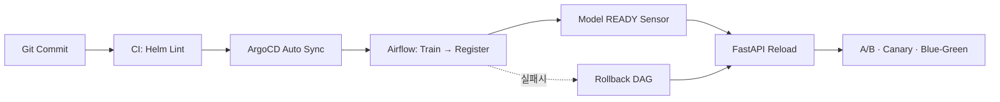

# 🧱 MLOps Infrastructure – One Commit Flow

> **Git 커밋 한 번으로
학습 → 등록 → 배포 → 실험 전환까지 자동 순환되는
GitOps 기반 MLOps Core 플랫폼**
> 

---

## 1. What This Project Proves

이 프로젝트는 단순한 ML 파이프라인 구현이 아니라,

**실무 환경에서 요구되는 MLOps Core 요건을
GitOps 기반으로 “운영 가능하게” 증명하는 것**을 목표로 합니다.

- 수동 배포/수동 롤백 없는 **완전 자동화 흐름**
- dev / prod 환경 분리와 상태 고정
- 실패 시 즉시 복원 가능한 운영 구조
- 코드가 아니라 **동작으로 증명되는 인프라**

---

## 2. Core Architecture

### 핵심 구성 요소

| 영역 | 스택 | 역할 |
| --- | --- | --- |
| Orchestration | **Airflow (KubernetesExecutor)** | 학습 → 평가 → 등록 → 롤백 제어 |
| Experiment | **MLflow (Tracking + Registry)** | 실험/모델 버전 관리 |
| Serving | **FastAPI** | A/B · Canary · Blue-Green 서빙 |
| Deployment | **ArgoCD (GitOps)** | Auto Sync · SelfHeal · Prune |
| Storage | **S3 + NFS + PostgreSQL** | 모델/로그/메타데이터 관리 |

---

## 3. One Commit Flow



> **코드 변경 → 자동 배포 → 자동 실험 전환**
> 
> 
> 운영 개입 없이 반복 가능한 MLOps 루프
> 

---

## 4. Proof of Operation

### ① dev / prod 환경 분리

```bash
kubectl get ns | egrep"airflow-|mlflow-|fastapi-|triton-"

```

### ② Feature Store Contract GitOps 관리

```bash
kubectl get cm -A -l mlops.keonho.io/env=dev
kubectl get cm -A -l mlops.keonho.io/env=prod

```

### ③ Runtime Mount 검증 (Airflow)

```bash
kubectl -n airflow-devexec <scheduler-pod> -- \
ls /opt/airflow/feature-store

```

### ④ GitOps Sync 상태

```bash
argocd app list

```

→ **설명 없이도 동작으로 증명 가능한 상태**

---

## 5. Repository Structure (Core 기준)

```bash
mlops-infra/
├── charts/            # airflow / mlflow / fastapi / triton
├── apps/              # root-app, namespaces, appset-core
├── envs/              # dev / prod 환경 정의
├── ops/               # secret rotation / reseal
└── dags/              # E2E Airflow DAG

```

---

## 6. Operational Principles

| 항목 | 설계 원칙 |
| --- | --- |
| 배포 | GitOps 기반 Auto Sync + SelfHeal |
| 안정성 | Sensor READY 후 Reload |
| 롤백 | DAG 기반 before_version 복원 |
| 환경 | dev / prod 완전 분리 |
| 증명 | kubectl / argocd 명령으로 확인 가능 |

---

## 7. Tech Stack

**Helm · Kubernetes · ArgoCD · Airflow · MLflow · FastAPI · S3 · PostgreSQL · NFS**

---

<details>
<summary>Optional / Future Extensions</summary>

- Triton Inference Server (GPU 서빙)
- Kubeflow Pipelines 연계
- LLMOps 확장

</details>
